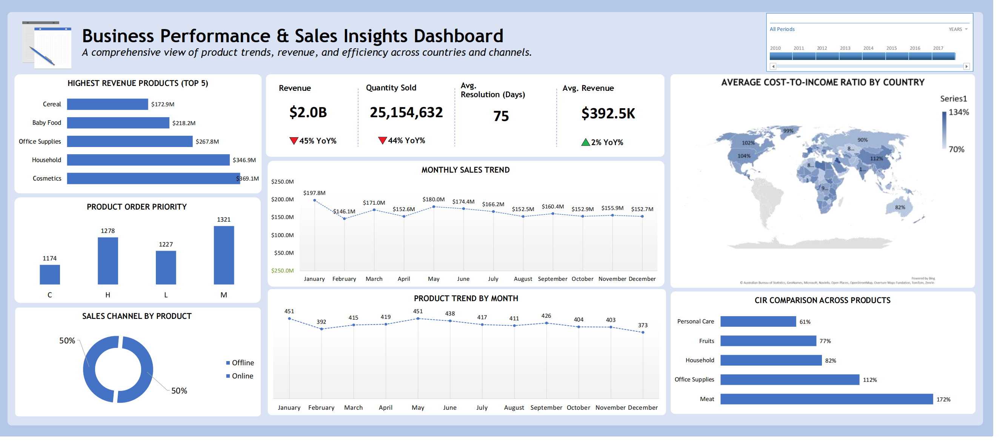

# 📊 Business Performance & Sales Insights Dashboard

This project showcases a comprehensive dashboard that analyzes **product performance, revenue, and efficiency** across multiple regions and channels.  
It combines **financial metrics (CIR, revenue)** with **sales insights (product trends, order priority, and channel distribution)** to deliver a full view of business health.

---

## 🚀 Overview

The **Business Performance & Sales Insights Dashboard** provides key indicators and visuals to monitor business operations and identify growth or efficiency gaps.

### 🔹 Key Metrics
- **Total Revenue:** $2.0B  
- **Quantity Sold:** 25,154,632 units  
- **Average Resolution Time:** 75 days  
- **Average Revenue per Product:** $392.5K  
- **Top 5 Products by Revenue:** Cosmetics, Household, Office Supplies, Baby Food, Cereal  
- **YoY Performance:**  
  - Revenue ↓ 45%  
  - Quantity Sold ↓ 44%  
  - Avg Revenue ↑ 2%  

---

## 📈 Dashboard Insights

- **Average CIR by Country:** Visual map comparing efficiency across global regions.  
- **Average CIR by Product:** Identifies which products drive higher or lower income efficiency.  
- **Top 5 Performing Products by Revenue:** Highlights best-selling product categories.  
- **Monthly Product & Sales Trend:** Shows monthly fluctuations in sales and product activity.  
- **Sales Channel by Product:** Displays online vs. offline performance split.  
- **Product Order Priority:** Visual breakdown of order urgency (Critical, High, Low, Medium).  

---

## 🧠 Tools & Techniques

- **Excel Power Query:** Data cleaning, transformation, and merging.  
- **Pivot Tables & Charts:** Summarization and dynamic visualization.  
- **Data Modeling:** Combining multiple data sources efficiently.  
- **Dashboard Design:** Creating a clean, professional interface with insights-driven visuals.  

---

## 🎯 Key Learnings

This project helped me strengthen:
- My data analysis workflow using **Excel Power Query**.  
- Building interactive dashboards with **clear KPI storytelling**.  
- Translating raw data into **business-ready insights** for decision-making.

---

## 📂 Project Type
- **Tool:** Microsoft Excel  
- **Focus Areas:** Data Analysis, Visualization, Dashboard Design  

---

## 🏁 Conclusion

The **Business Performance & Sales Insights Dashboard** delivers a clear, data-driven view of company performance — helping identify top-performing products, track efficiency via CIR, and understand sales behavior across months, countries, and channels.

---

